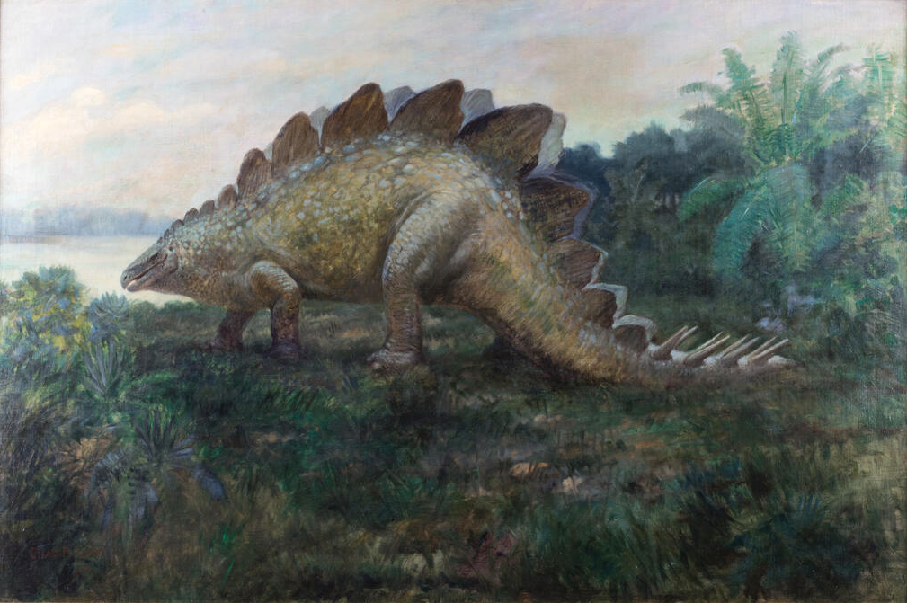
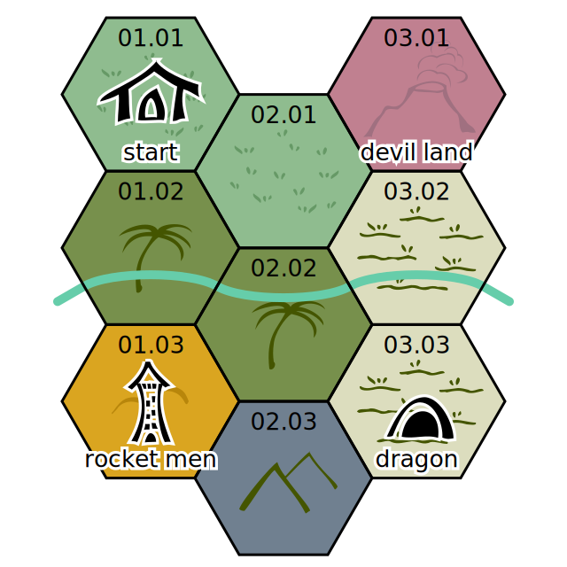
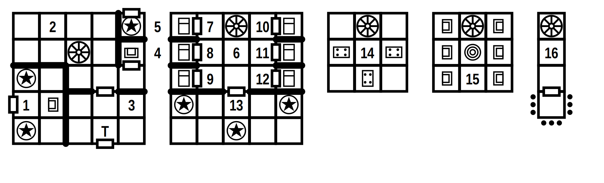

# Ugh Nugh and the bleeping invasion

*Gather your stoner friends, pick up those spears and travel through
the subterranean dinosaur refuge to find the source of the flying
drones that keep pestering your tribe. Infiltrate the lair of the
rocket men and wrest the eye of eyes from their cold gauntlets and
return your land to peace and quiet.*

<figure>
<figcaption>
Life restoration of <i>Stegosaurus ungulatus</i> Marsh. By Charles R.
Knight, 1901. After F.A. Lucas. Charles Robert Knight (1874–1953). In
the public domain.
</figcaption>
</figure>

The drones have been spying on your every move, watching your most
intimate moments, with incessant humming and beeping and blinking.
You've smashed a few but enough is enough. They come from accross the
river and that needs to stop.

## Wilderness

**01.01** Your village is safe. There are about 20 **people** here
that you could arm with spears (HD 1 AC 9 1d6
<i>spear</i> MV 12 SV 19).

**01.02** The jungle is dense. 3 **velociraptor** hunting (HD 2 AC 7 1d6/1d4/1d4 <i>bite + claws</i> MV 18
SV 18). A fight attracts one of the **drones**, betraying your
intentions (HD ½ AC 0 1d6 <i>shock</i> MV 15
SV 16).

**01.03** Up in these hills stands the *fortress of the rocket men*
(see below). Do you approach openly or discreetly?

**02.01** Your favourite hunting grounds. An open *pit trap* of yours
with a **giant armadillo** (HD 5 AC 5 1d6/1d4/1d4
<i>bite + claws</i> MV 6 SV 15).

**02.02** The jungle turns into swamp. 3 **hadrosaurs** grazing (HD 4 AC 7 1d6/1d6 <i>feet</i> MV 15 SV 16).

**02.03** Dark mountains rise from the jungle. A **pteranodon** flies
overhead looking for halflings (HD 3 AC 8 1d4
<i>beak</i> MV 24 SV 17).

**03.01** An active volcano. Poisonous vapours
(save vs. poison every turn or faint for a turn; die if you fainted
three times in a day). Captain **Flateem** is here, in her
suit, taking tectonic measurements (HD 3 AC 2 1d6
<i>zap gun</i> MV 12 SV 16).

**03.02** The flood plain is infested with **cricosaurus**. You'll
meet one soon enough (HD 3 AC 4 1d6 <i>bite +
hold</i> MV 12 SV 17; they never let go of living prey and just keep
dealing damage).

**03.03** On a compost heap 10m high is the lair of an intelligent,
fire-breathing **dragonodon** (HD 10 AC 3
2d6/1d4/1d4 <i>bite + claws</i> MV 12 SV 17; 2/day: 6d6 <i>fire</i>
cone, save vs. breath for half).

## Fortress of the rocket men

**1** Throne room. Two **guardian angels** (HD 5
AC 4 1d10 <i>blade</i> MV 6 SV 10). If approached openly,
**Abel** is here, in his suit (HD 3 AC 2 1d6
<i>zap gun</i> MV 12 <i>fly</i> SV 16).

**2** Storage space with dinosaur bones, gardening tools, a small
excavator, a large drill, a solar panel and device charger and *a lot*
of pictures of your tribe.

**3** The back entrance leads into a trapped room. Without a powered
suit of the rocket men, the alarm sounds and 3 **auto zap guns** shoot
at anything that moves (save vs. wands to avoid
1d6 damage).

**4** Empty control seat. If approached discreetly *and discovered*,
**Abel** is here, in his suit (HD 3 AC 2 1d6
<i>zap gun</i> MV 12 <i>fly</i> SV 16), controlling the
guardian angel of room 5.

**5** A hidden door hides a **guardian angel** that can be sent out
on find and rescue missions, or to investigate any approaching
outsiders (HD 5 AC 4 1d10 <i>blade</i> or 1d6
<i>zap gun</i> MV 6 <i>fly</i> SV 10).

**6** Common room. If the alarm sounds, **Chrysethum** and **Drogon**
are here, in their suit (HD 3 AC 2 1d6 <i>zap
gun</i> MV 12 SV 16).

**7** *Abel*'s bedroom.

**8** *Berta*'s bedroom.

**9** *Chrysethum*'s bedroom. If the alarm did not sound, they're
here, sleeping, out of their suit (HD 3 AC 9 1d6
<i>zap gun</i> MV 12 SV 17).

**10** *Drogon*'s bedroom. If the alarm did not sound, he's here,
reading, out of his suit (HD 3 AC 9 1d6 <i>zap
gun</i> MV 12 SV 17).

**11** *Eelam*'s bedroom. Half-eaten leftovers on the bed. It a
stinking mess. His empty suit is here.

**12** *Flateem*'s bedroom.

**13** Combat training room with wooden melee weapons. Three
**guardian angels** in training mode (HD 5 AC 4
<i>save vs. paralysis or faint for a turn</i> MV 3 SV 10).

**14** Canteen. **Berta** is here, in her suit, getting ready for her
shift outside, drinking some water (HD 3 AC 9 1d6
<i>zap gun</i> MV 12 SV 17). If **Abel** wasn't on the ground
floor, he's also sitting here, looking at pictures of your clan.

**15** Control room with six monitor and the *eye of eyes* that
controls the drones. **Elam** is here, not in his suit, looking for
approaching outsiders (HD 3 AC 9 1d6 <i>zap
gun</i> MV 12 SV 17).

**16** Sense array with antennas going in every direction. A locked
door leads to a platform outside. A suit is required to open the door.

<h2>Treasure</h2>

The thermal isolation layer of each <em>suit</em> allows
you to extract gold filaments worth 500 gold, each. They can also be
sold for 750 gold. Each suit can fly for 6 turns, except for the one
*Flateem* is wearing. That suit already spent 3 turns for the day.

Each <em>zap gun</em> can be sold for 500 gold. They are
all charged and able to fire 20 shots.

Without a way to control the <em>guardian angels</em>, each
can be sold as a fantastic statue for 1000 gold.

The <em>device charger</em> at the base of the tower can
recharge one device over night. Destroying it poisons the land for ten
miles in every direction. Most people will not appreciate what it is
for and therefore it cannot be sold for money.

Max. gold value: 13 500. Taking over the tower of the rocket men and
learning all their secrets: <em>priceless</em>.

