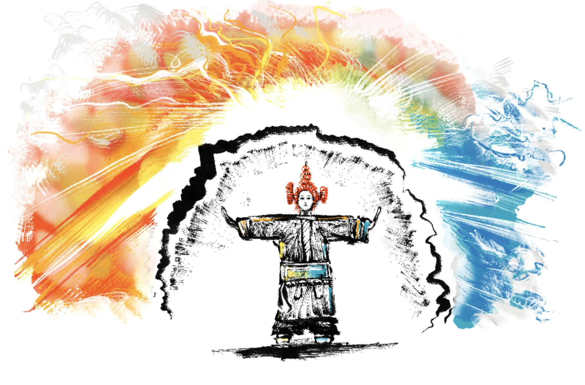

<address>Alex Schroeder</address>

# The Sewer Prison

Playtest Edition

For characters level 1–5 including hirelings and porters.

2022-12-14

## Level 1

| 1W6 | Monster                  |
|:---:|--------------------------|
| 1   | 1W6 …                    |
| 2   | 1W6 …                    |
| 3   | 2W6 wardens and 1d4 dogs |
| 4   | …                        |
| 5   | …                        |
| 6   | crazy inmate             |
|     |                          |

2d6 **wardens** from area 15 or 22 (HD 1 AC 7 1d6 F1 MV 12 ML 8) with
1d4 **guard dogs** (HD 2+2 AC 7 1d6 F2 MV 15 ML 8) on patrol,
searching for people that aren't on the direct way from the entrance
to a temple or back, name the temple or reduce reaction roll result by
2.

**Crazy inmate**, harmless (HD 1 AC 9 0 NM MV 12 ML 6), may provide
helpful info on a positive reaction roll. Roll 1d6: 1. underneath the
temple of Garaskis there is a cursed lake; 2. don't drink water from
the fountains; 3. Hepsod dug a hole in his cells and fled; 4. there is
a secret temple on level 5 somewhere; 5. .... 6. ...

### Special rule

The crab demon *Garaskis* wants your body and your soul. It will use
*water* to infect you. Every time you see a fountain or a body of
water, *save vs. spells* or drink some water. If you have a waterskin
or wineskin, take a sip. If you rolled a 1 or 2, you drank it all.
Next time you fail your *save vs. spells*, you'll drink the demon's
water. If you do, *save vs. poison* or become *infected*. In times of
need, the infected need to roll 2d6. On a 2, you're raving mad and
attack your friends! On a 3–6 you stall and do nothing. On a 7–9,
choose one of the following drawbacks. On a 10–11, you do what you
wanted to do. On a 12, you can shake it off!

| 1W6 | Effect                                                                                                                                 |
|:---:|----------------------------------------------------------------------------------------------------------------------------------------|
| 1–2 | Act normally but howl madly while you do it, causing an immediate random encounter check.                                              |
| 3–4 | Act slowly and skip a round before acting                                                                                              |
| 5–6 | Act rashly and endanger your friends, dealing 1d6 damage to one of   them (drop a rope they're on, swing your weapon recklessly, etc.) |

### Rooms

1. A square room, flagstones, corridors. Light falls in from above.
   The stairs lead outside. **Ingolde Linzapf** is chained to wall
   here. She used to be the lawful *toll master* of Kerealia's harbor.
   Freeing her will gain you a loyal friend. She's a level 1 fighter.

2. A bridge across a great pit. Note the portcullis at the bottom of
   the pit.

3. …

4. …

5. A guard room with a window looking at the corridor containing 4
   **wardens** (HD 1 AC 7 1d6 F1 MV 12 ML 8) and 1 **guard dog** (HD
   2+2 AC 7 1d6 F2 MV 15 ML 8). Unless special caution is taken, the
   dog should pick up on anybody sneaking around outside.

6. …

7. …

8. …

9. A **statue** of a cat-headed woman. An inscription says this is
   *Maftet*. Pillars and curtains covering the walls (concealing a
   door). The pillars have inscriptions saying Maftet is a goddess of
   justice and praising her ability to punish criminals. Smashing her
   statue reveals a **mummified jaguar** inside; its eyes are *two
   rubies* worth 100gp each. The jaguar will animate after 10min
   unless burned to ashes and attempt to stalk and slay the one who
   smashed the statue (HD 3+1 AC 4 1d12 F3 MV 6 ML 12; *dread* – sv.
   vs. paralysis when you see it; *cursed* – when hit by the mummified
   jaguar, you can no longer heal or be healed until the curse is
   broken).

10. A **statue** of cat-headed Maftet ripping out the heart of
    criminals and presenting them at an altar; a dais covered in dark
    brown substance (old blood); a coded inscription requiring *read
    languages* to decipher revealing that presenting a heart on the
    dais and chanting *The Invocation of Maftet's Justice* will summon
    a **cat demon** (HD 4+1 AC 4 1d4/1d4/1d8 F4 MV 21) to exact your
    punishment upon others (requires a scroll found elsewhere).

11. The *secret door* is a relief of a big cat with a movable tail;
    pushing the tail down allows you to move the relief aside and
    reveals a treasure chamber: 5000gp, golden claws and other jewelry
    worth 2000gp.

12. Curtains *conceal* the door to this room; the **priest** calls
    himself *Eater of Hearts* (HD 3 AC 3 1d4/1d4 C3 MV 12 ML 10) and
    wields *Maftet's Claws* (grants two attacks for 1d4 and the
    ability to climb sheer walls on 1–5/6) and his pet **mountain
    lion** (HD 3+2 AC 6 1d3/1d3/1d6 F2 MV 15 ML 8) await intruders; a
    large stone *cat face* with a gaping maw on the north wall; the
    priest might flee into the maw.

13. The *secret door* opens if you press a hard to find button in the
    gaping maw of the large stone cat face; a black crawlspace;
    without a light source, 1–2/6 chance to drop into the open shaft
    at the end and fall down 50ft (5d6 damage).

14. *Cells* with iron bars, all of them locked; the floor covered by
    straw, the floor made of packed earth. The *straw* in cell *h* can
    be brushed aside to reveal a wooden floor with a *secret trap
    door*.

15. …

16. …

17. …

18. …

19. …

20. …

21. …

22. …

23. …

24. …

25. …

26. This is also the **defiler** of Sekhmet's temple (area 32).

27. …

28. …

29. …

30. …

31. …

32. A *statue of a woman with a lion face*, defaced and covered in
    dried blood and faeces. The inscriptions say that the lion-headed
    woman is *Sekhmet*, goddess of fire, war, vengeance, menstruation,
    and medicine. This is a desecrated temple. Sanctification of the
    temple requires a clean-up and a *vow of vengeance* on the
    defilers (see area 26). If the defiler is brought here and killed
    on the spot, *Sekhmet's Blessing* is yours for a year and a day:
    +1 to-hit, +1 to damage (does not stack with the *bless* spell,
    obviously).

## Level 2

| 1W6 | Monster |
|:---:|---------|
| 1   | 1W6 …   |
| 2   | 1W6 …   |
| 3   | 1W6 …   |
| 4   | …       |
| 5   | …       |
| 6   | …       |

### Rooms

1. …
2. …

## Level 3

| 1W6 | Monster |
|:---:|---------|
| 1   | 1W6 …   |
| 2   | 1W6 …   |
| 3   | 1W6 …   |
| 4   | …       |
| 5   | …       |
| 6   | …       |

### Rooms

1. …
2. …

## Level 4

| 1W6 | Monster |
|:---:|---------|
| 1   | 1W6 …   |
| 2   | 1W6 …   |
| 3   | 1W6 …   |
| 4   | …       |
| 5   | …       |
| 6   | …       |

### Rooms

1. …
2. …

## Level 5

| 1W6 | Monster |
|:---:|---------|
| 1   | 1W6 …   |
| 2   | 1W6 …   |
| 3   | 1W6 …   |
| 4   | …       |
| 5   | …       |
| 6   | …       |

### Rooms

1. …
2. …

## Level 6

| 1W6 | Monster |
|:---:|---------|
| 1   | 1W6 …   |
| 2   | 1W6 …   |
| 3   | 1W6 …   |
| 4   | …       |
| 5   | …       |
| 6   | …       |

### Rooms

1. …
2. …
