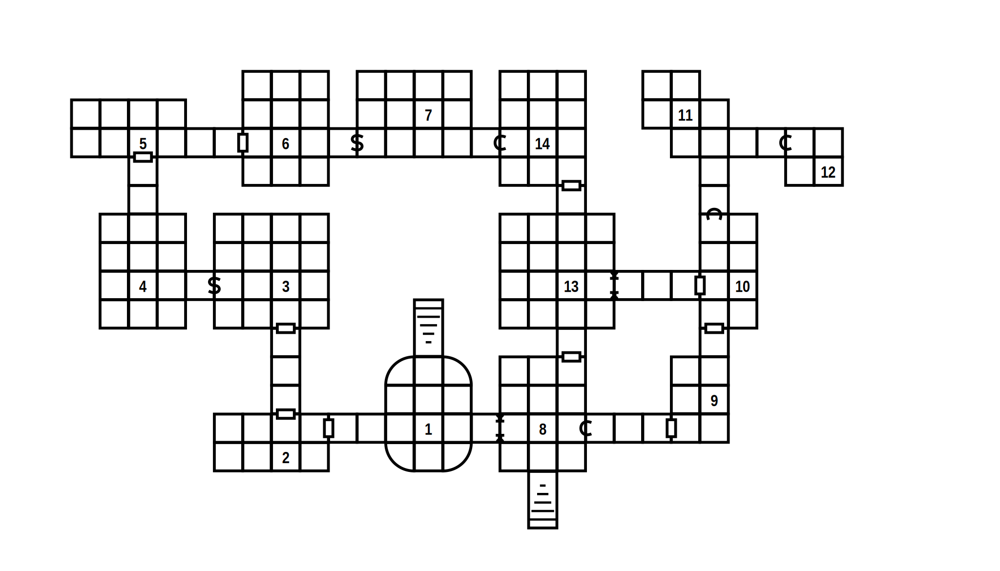
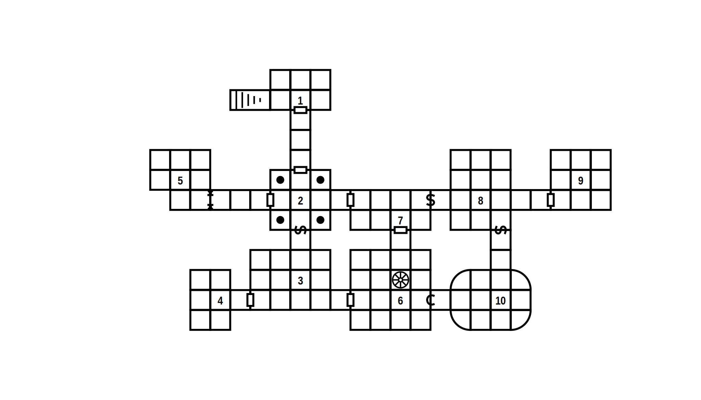
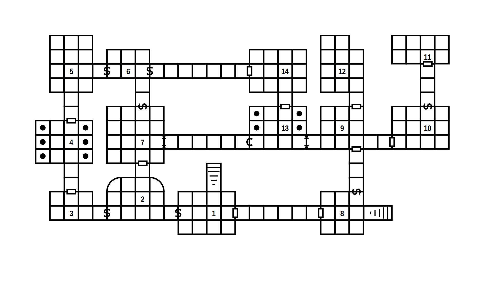

# Improvising 1000 dungeons

You don't need much: maps, a theme, some monsters, tricks and traps,
some magic items.

## Theme

1. A bandit hideout: thieves, wooden platforms, bags, chests, stars, wooden floors.
2. An elfish ruin: green glass, floral columns, round rooms, banshees, spectres.
3. A dwarven ruin: brass machines, tiny tunnels, clockwork traps, galleries, open spaces.
4. A temple of Set: snakes, pits, fumes, braziers, singing, sleeping, processions.
5. A gate to Jötunheim: an ice devil, trolls, frost giants, huge halls, wind like knives.
6. The temple of Mitra is corrupt: evil bureaucrats, bulls, holy fires, chanting.

## Mission

1. To steal a relic, but taking it brings ancient foes to life.
2. To kill the monster, but actually your rulers are the monster.
3. To bring a gift, and learn of an ancient crime your clan perpetuated.
4. To free a prisoner, get drawn into the conflict of two families,
   both alike in dignity.
5. To bring back a lost child, it's time to get married.
6. Root out evil but don't cause a scandal. Find the one who does not
   follow orders.

## Monsters

1. Dogs and wolves are guardians. If they breathe fire or ice, they can speak.
2. Giants are surrounded by their loyal friends. When they attack, the earth shakes.
4. Freezing, charming, sleeping: a spell caster turns friends into liabilities.
3. Humanoids lure you in and then they circle back and cut off your retreat.
5. Two factions: cautious and willing to talk vs. angry and raging.
6. When the party splits, the weaker half is easy prey for sneaky stranglers.

## Tricks and Traps

1. A big monsters from the old days has great magical powers, knows a
   lot and is willing to talk, but also interested in charming you.
2. A careless foe is drunk or sleeping, easy to interrogate.
3. This room is an obvious trap: snakes, spikes, snares. Secure it now
   or suffer when you need to run.
4. Remove the statue and fire blasts you. Notice the soot and the hole.
5. Sit on this chair and they can trigger the blade when you displease
   them. Notice the slit.
6. If you stand in front of them, their servant triggers the pit trap
   and you slide towards the brute monster below.

## Magic Items

1. A goblin assassin’s black iron *crossbow* +1, decorated with the seven heads of Set.
2. An orcish *zweihänder* +1/+3 vs. city dwellers, in the *Long Monkey Stab* tradition.
3. A scroll of *crashing gates* (destroy one door up to 20m wide).
4. A prayer of *summoning* the **naga** *Terrible Queen of Death*, from Eiterhorg in Svartalfheim; *fireball* 3×/day; *charm person* at will; only harmed by magic or magic weapons.
5. A potion of *bellowing* (light yellow, 1h, allows you to bellow so loud that your voice can be heard for many miles).
6. The *necklace of dharma* allows you to borrow actions from your future self: act twice this round to do what needs to be done but skip the next round.

## Maps

